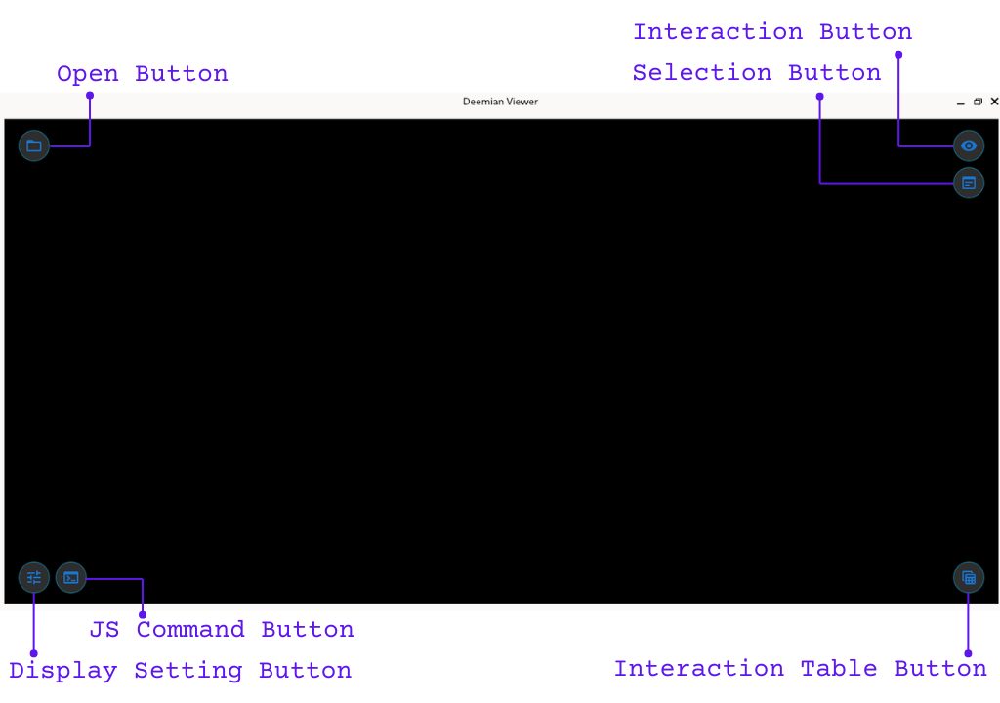
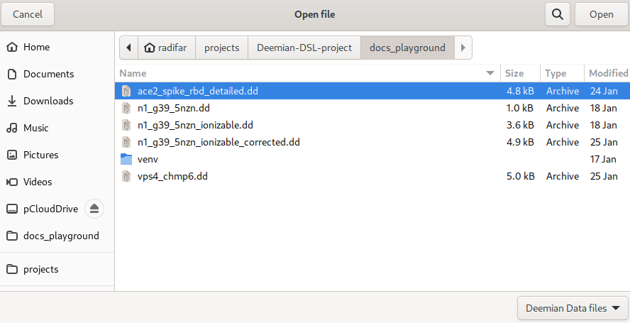
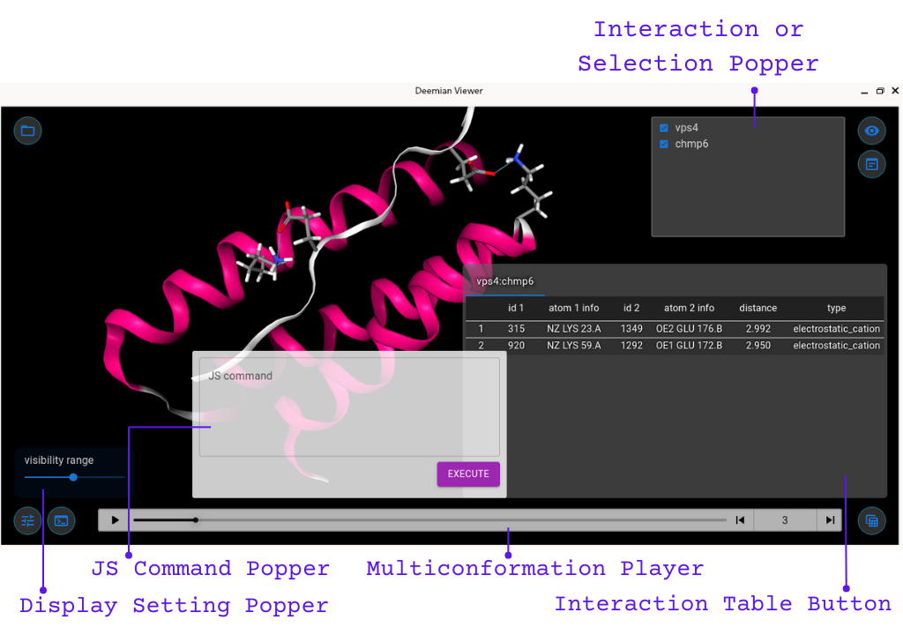

# Deemian Viewer

  

Deemian Viewer is a Graphical User Interface (GUI) for visualizing the interaction analysis result from [Deemian](https://deemian-dsl.readthedocs.io/en/latest/index.html).

## How to get Deemian Viewer

> [!NOTE]
> 
> Deemian Viewer is currently **only available in Linux and Windows**.
> 
> Unfortunately the Mac OS version is still not available as I do not have access to Mac OS and therefore I can not build it and test it on Mac OS.
> Also, please bear in mind that at the moment Deemian Viewer only tested on Windows 10 and Linux Fedora 36 and thus it may not working properly in other Windows version or other Linux distro.

First download Deemian Viewer at the [release page](https://github.com/radifar/deemian_viewer/releases) of Deemian Viewer, and extract the compressed file.
The extracted files require around 500+ MBs, so please make sure you have enough space for your works.
In the main directory, there are one executable file, and two subdirectory.
The executable is `deemian-viewer` in Linux or `deemian-viewer.exe` in Windows.
The first subdirectory is `_internal` which contain all the binaries and data required by Deemian Viewer to run.
And the second subdirectory is `example` which contain the Deemian Data (.dd extension) files and the accompanying pdb files that will be loaded when opening the Deemian Data file.

## Brief introduction to the User Interface

Opening the Deemian Viewer will display the following User Interface (UI):

We can see the stage is still empty and it only display black background.
At each corner we can see several buttons.
At the top left corner is the **Open Button** which will show an `Open File` dialog window:

The other buttons are for displaying variety of popper such as `Interaction Popper`, `Selection Popper`, `Interaction Table Popper`, `JS Command Popper` and `Display Setting Popper`:

Please note that `Interaction Popper` and `Selection Popper` can not be shown at once as they occupy the same space.
There is also a `Multiconformer Player` that will appear automatically when opening Deemian analysis result containing multiconformer or trajectory analysis.

To hide the Popper, click the corresponding Button.

## Getting started

To get started with Deemian Viewer we will be using the example Deemian Data files that come together with the executable Deemian Viewer.
We will start from the simplest one, `n1_g39_5nzn_ionizable_corrected.dd`, which is the analysis result from Deemian [Getting Started](https://deemian-dsl.readthedocs.io/en/latest/usage/gettingstarted.html) walkthrough.

First, lets open `deemian-viewer` (Linux) or `deemian-viewer.exe` (Windows), which will open the empty interface.
Next, click the open button and we will see the content of the directory where the executable is located.
And as we can see, there are two directories: `examples` and `_internal` directory, which I already explained above.
Now enter the `examples` directory, there are three Deemian Data files, which were generated from the Deemian Getting Started and Tutorial walkthrough.
For now, lets try opening the `n1_g39_5nzn_ionizable_corrected.dd` file.

As shown in the short video below, after opening the file, we can rotate the molecule using drag and drop movement, zoom the molecule using scoll button, and center the oseltamivir by clicking one of the oseltamivir atom.
Then we can also adjust the visibility range, display the interaction table, toggle the visibility the interactions, and toggle the visibility of the selections.

https://github.com/radifar/deemian_viewer/assets/11450417/066588a0-d704-4759-8d80-3e56b67c4b54

Getting Started with Deemian Viewer.

Of course, the interface could be slightly different depending on the interaction analysis details.
For example, when using multiple interaction pair like in [SARS-CoV-2 RBD and ACE2 analysis](https://deemian-dsl.readthedocs.io/en/latest/usage/tutorial/analyze_omicron_multiselection.html), we can see that Deemian Viewer will display multiple table with tabs.
While when opening a [multiconformer interaction analysis of VPS4 and CHMP6](https://deemian-dsl.readthedocs.io/en/latest/usage/tutorial/analyze_multimodel.html), we can see a `Multiconformation Player` at the bottom.

https://github.com/radifar/deemian_viewer/assets/11450417/ab12850b-ed93-4a86-a2f2-a2c322e38422

Multiple table with tabs.

https://github.com/radifar/deemian_viewer/assets/11450417/1415ff20-e07b-483e-aa26-acfa07bb73e3

Multiconformer analysis with `Multiconformation Player`.

## Contributing

Interested in contributing? Check out the contributing guidelines. Please note that this project is released with a Code of Conduct. By contributing to this project, you agree to abide by its terms.

## License

`deemian_viewer` was created by Muhammad Radifar. It is licensed under the terms of the Apache License 2.0 license.

## Credits

`deemian_viewer` was created with [`cookiecutter`](https://cookiecutter.readthedocs.io/en/latest/) and the `py-pkgs-cookiecutter` [template](https://github.com/py-pkgs/py-pkgs-cookiecutter).
